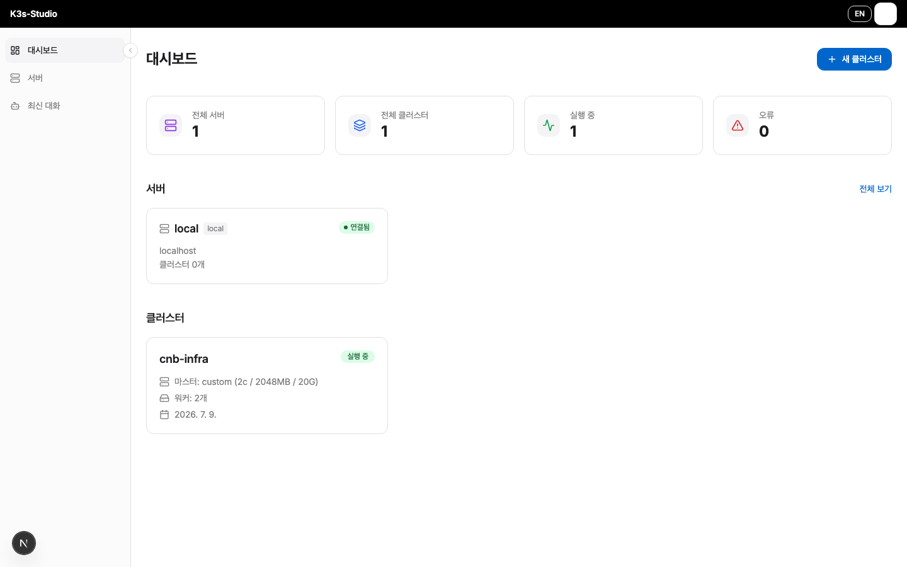
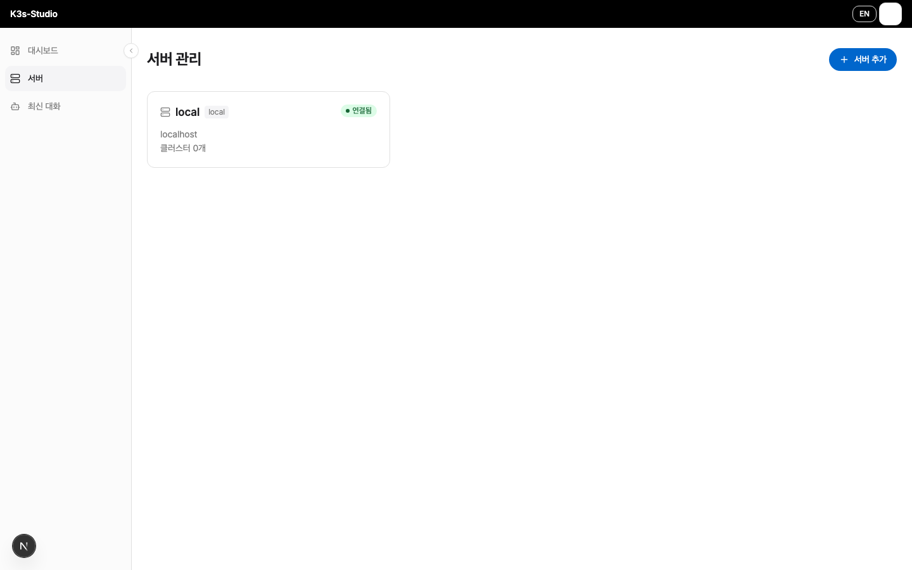
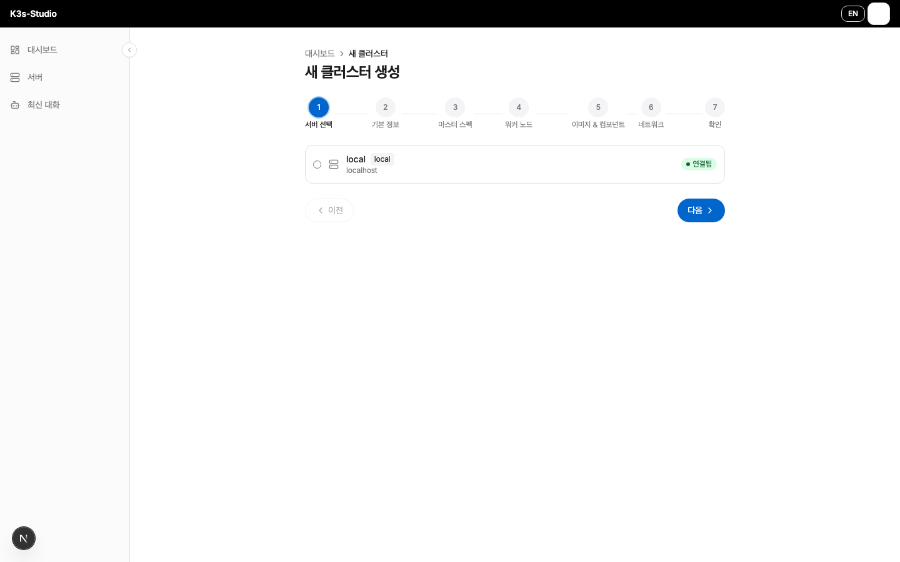
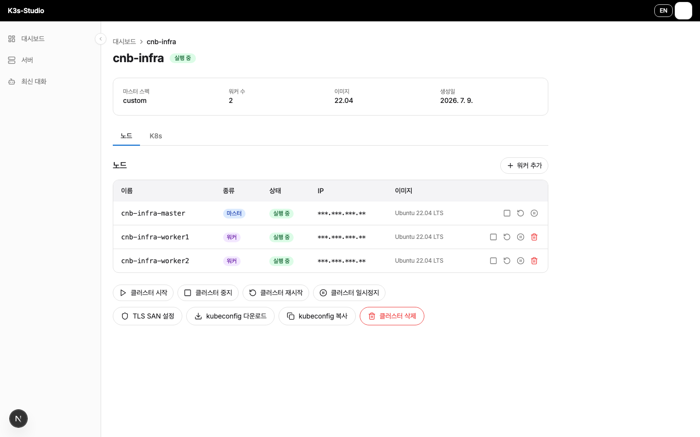
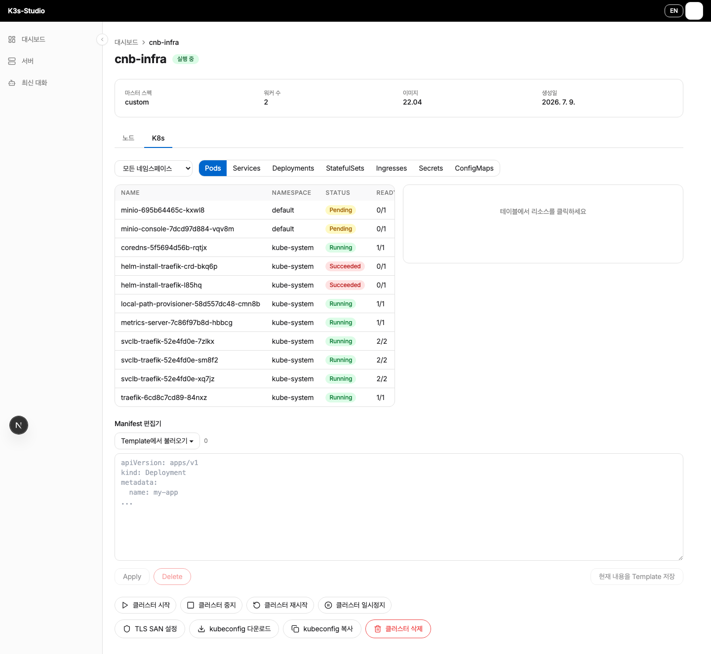
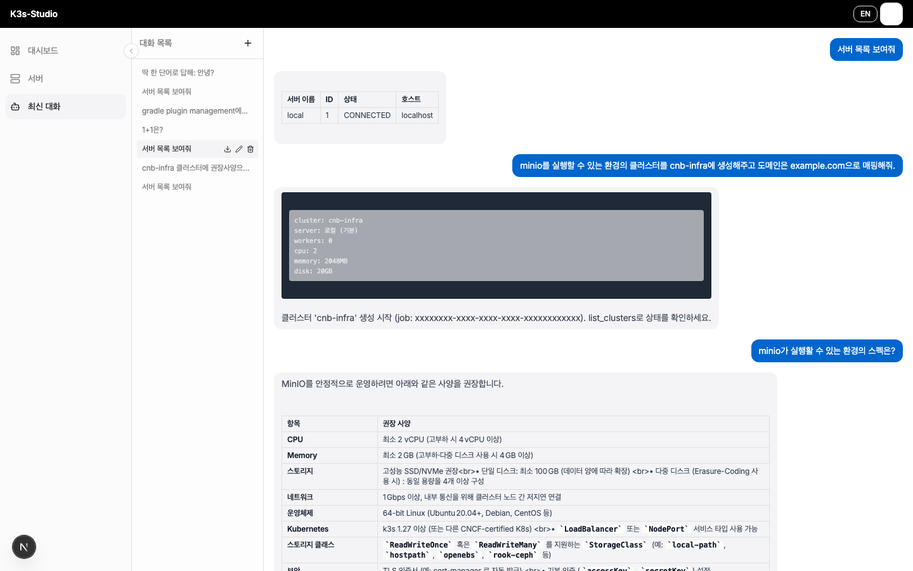
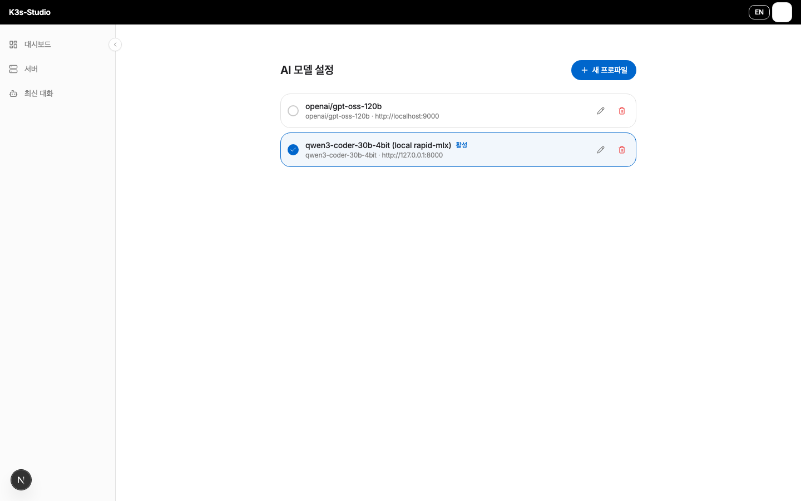

# K3s-Studio — Multipass K3s Cluster Manager

[](LICENSE)


Multipass 기반 K3s 클러스터를 자연어와 Web UI로 통합 관리하는 플랫폼입니다.
명령어 기반을 선호하시는 분들은 [mpk3s-cli](README-CLI.MD) 문서를 참고하세요.
---

## Features

- **Web UI & Dashboard** — 클러스터/서버/노드 상태 실시간 모니터링 및 제어
- **멀티 호스트** — 로컬 Multipass 및 원격 SSH 서버의 Multipass 인스턴스 통합 관리
- **자동 프로비저닝** — Master + Worker 노드 사양 지정 후 원클릭 생성
- **K8s 리소스 관리** — Pod/Service/Deployment 등 Manifest 편집·Apply·Delete
- **AI 관리자** — OpenAI-compatible API(Ollama, OpenAI 등)로 자연어 클러스터 제어
- **MCP Server** — Claude Desktop에서 k3s-studio 전체 기능을 도구로 호출
- **SSE 실시간 스트리밍** — 클러스터 생성·AI 응답 모두 스트리밍으로 확인

---

## Screenshots

### 대시보드

전체 서버/클러스터 현황을 한눈에 확인합니다.



### 서버 관리

로컬 및 원격 Multipass 서버를 등록·관리합니다.



### 클러스터 생성 마법사

서버 선택 → 기본 정보 → 마스터 스펙 → 워커 노드 → 이미지/컴포넌트 → 네트워크 → 확인의 7단계로 클러스터를 자동 프로비저닝합니다.



### 클러스터·노드 관리

마스터/워커 노드 상태 확인, 워커 추가·삭제, 클러스터 시작/중지/재시작/일시정지, kubeconfig 다운로드·복사를 지원합니다.



### K8s 리소스 관리

Pod/Service/Deployment/StatefulSet/Ingress/Secret/ConfigMap을 조회하고, Manifest 편집기로 YAML을 직접 Apply·Delete합니다.



### AI 관리자

자연어 명령으로 서버 조회, 클러스터 생성, 매니페스트 배포 등을 수행하고 실행 결과를 스트리밍으로 확인합니다.



### AI 모델 설정

Ollama, OpenAI 등 OpenAI-compatible API 프로필을 여러 개 등록하고 전환합니다.



---

## Project Structure

```
k3s-studio/
├── apps/
│   ├── k3s-studio-api/   # Spring Boot 3.4 REST API (포트 9090)
│   ├── k3s-studio-ui/    # Next.js 15 Web UI (포트 3000)
│   └── k3s-studio-mcp/   # MCP Server (Claude Desktop 연동)
├── containers/           # PostgreSQL 17 + Liquibase Docker Compose
│   └── liquibase-data/   # Liquibase DB 스키마 changelog (XML)
└── bin/                  # CLI 실행 스크립트
```

---

## Quick Start

### 전제 조건

- macOS (Multipass 실행 환경)
- [Multipass](https://multipass.run) 설치
- Docker (PostgreSQL 실행용)
- Java 21+, Node.js 20+

### 1. 데이터베이스

```bash
docker compose -f containers/docker-compose.yml up -d
```

PostgreSQL 17이 포트 5433에서 실행됩니다.

### 2. 백엔드 API

```bash
cd apps/k3s-studio-api
./gradlew bootRun
# http://localhost:9090
```

### 3. Web UI

```bash
cd apps/k3s-studio-ui
npm install
npm run dev
# http://localhost:3000
```

---

## Docker로 실행하기

DB + API + UI를 컨테이너로 한 번에 띄웁니다. **이 모드는 원격 SSH Multipass 서버만 관리할 수 있습니다** — API 컨테이너 자체에는 Multipass가 없으므로, 로컬 Multipass를 직접 제어하려면 위 [Quick Start](#quick-start)의 네이티브 실행을 사용하세요.

### 전제 조건

- Docker + Docker Compose
- 관리할 Multipass가 설치된 원격 서버(SSH 접속 가능)

### 실행

```bash
cp .env.example .env
# .env에서 DB_PASSWORD 설정, ENCRYPTION_KEY는 아래로 생성
openssl rand -hex 32   # → ENCRYPTION_KEY에 붙여넣기

docker compose up -d --build
```

- UI: http://localhost:3000
- API: http://localhost:9090

첫 접속 후 **서버 관리**에서 원격 서버를 SSH로 등록해야 클러스터를 생성할 수 있습니다(로컬 서버는 자동 등록되지 않음).

### 미리 빌드된 이미지

릴리스 태그(`v*`)가 푸시되면 GitHub Actions가 GHCR에 이미지를 퍼블리시합니다:

```
ghcr.io/cnbsoft-com/k3s-studio-api:latest
ghcr.io/cnbsoft-com/k3s-studio-ui:latest
```

`docker-compose.yml`의 `build:` 항목을 `image: ghcr.io/cnbsoft-com/k3s-studio-<api|ui>:latest`로 바꾸면 직접 빌드 없이 바로 사용할 수 있습니다.

---

## AI 관리자

Web UI 사이드바의 **AI 관리** 메뉴에서 자연어로 k3s-studio를 제어합니다.

### 설정

`/settings/ai` 에서 모델 URL과 이름을 입력합니다.

| 제공자 | Model API URL | 모델 이름 예시 |
|--------|--------------|----------------|
| Ollama (로컬) | `http://localhost:11434` | `qwen2.5-coder:7b` |
| OpenAI | `https://api.openai.com` | `gpt-4o` |
| 기타 OpenAI 호환 | 해당 URL | 해당 모델명 |

### 내장 도구

| 도구 | 설명 |
|------|------|
| `list_servers` | 등록된 서버 목록 |
| `list_clusters` | k3s 클러스터 목록 |
| `list_namespaces` | 클러스터 네임스페이스 목록 |
| `list_pods` | 파드 목록 |
| `get_pod_logs` | 파드 로그 (최대 200줄) |
| `apply_manifest` | YAML 매니페스트 적용 |
| `delete_manifest` | YAML 매니페스트 삭제 |

---

## MCP Server (Claude Desktop)

Claude Desktop에서 k3s-studio API를 직접 도구로 호출합니다.

```bash
cd apps/k3s-studio-mcp
npm install && npm run build
```

`~/Library/Application Support/Claude/claude_desktop_config.json`:

```json
{
  "mcpServers": {
    "k3s-studio": {
      "command": "node",
      "args": ["/path/to/k3s-studio/apps/k3s-studio-mcp/dist/index.js"],
      "env": {
        "K3S_STUDIO_API_URL": "http://localhost:9090"
      }
    }
  }
}
```

---

## Roadmap

진행 중인 기능 제안은 [GitHub Issues](https://github.com/cnbsoft-com/k3s-studio/issues)에서 추적합니다.

- [ ] 마운트 기능 (호스트 ↔ VM 디렉토리 공유) — [#16](https://github.com/cnbsoft-com/k3s-studio/issues/16)
- [ ] kubeconfig 클립보드 복사 — [#17](https://github.com/cnbsoft-com/k3s-studio/issues/17)

---

## License

MIT License — [LICENSE](LICENSE)

---

*Developed by IK-YONG CHOI*
